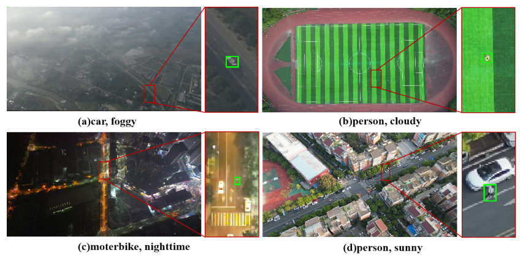

# OLOD
OLOD: A New UAV Dataset and Benchmark for Single Tiny Object Tracking

#### *Intro*

:airplane: OLOD, which is the first benchmark test designed specifically for drone tracking and dedicated to a comprehensive evaluation of tiny object tracking performance, aims to establish a standardized assessment. It consists of over 55.5k manually annotated frames, making it suitable for large-scale evaluations. The benchmark includes a total of 55,473 frames, with an average of 793 frames per sequence, ranging from 319 frames to a maximum of 1,353 frames. The videos were recorded at a frame rate of 30 frames per second (FPS) with a resolution of 3840*2160. The average duration of each video segment is 26.42 seconds, indicating relatively longer video sequences.

#### *Data*

:signal_strength: All the data will be released in Google Driver & Baidu Driver when accepted.

#### *Evaluation Code*

:desktop_computer: We will release all the evaluation codes used in the paper, 

Branch: D3S  is an example of D3S applyment.

_Platform_: python3.8, torch1.11.

_Fixed_:  rfft / stride.

#### *Raw Results*

:raised_back_of_hand: All the raw results that appeared in the paper will be released in Google Driver when accepted.
