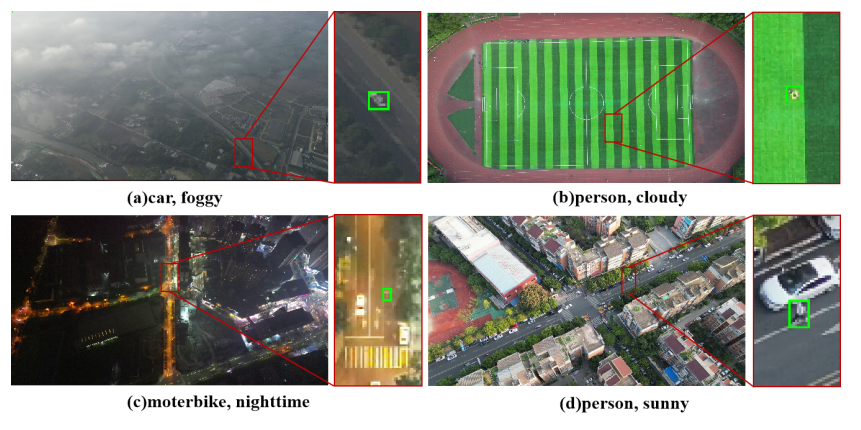

# OLOD

**O**verhead **L**ook **O**f **D**rones — a UAV dataset and benchmark for single tiny object tracking.

[](https://doi.org/10.1080/01431161.2024.2354127)
[](https://pan.baidu.com/s/1RDF6LEFWzM8QzYtQo5V_fQ?pwd=t7TS)
[](LICENSE)

Official repository for:

> Mengfan Yu, Yulong Duan, You Wan, Xin Lu, Shubin Lyu, Fusheng Li. **OLOD: a new UAV dataset and benchmark for single tiny object tracking.** *International Journal of Remote Sensing*, 45(13):4255–4277, 2024.

[Paper](https://doi.org/10.1080/01431161.2024.2354127) · [Dataset](https://pan.baidu.com/s/1RDF6LEFWzM8QzYtQo5V_fQ?pwd=t7TS) · [Evaluation toolkit (`d3s`)](https://github.com/yuymf/OLOD/tree/d3s)

<p align="center">
  
</p>

## News

- **2026-08-30** — Dataset released on [Baidu Netdisk](https://pan.baidu.com/s/1RDF6LEFWzM8QzYtQo5V_fQ?pwd=t7TS) (extraction code: `t7TS`).
- **2024-06** — Paper published in *International Journal of Remote Sensing*.

## Introduction

Existing UAV tracking datasets mainly cover large, well-contoured objects and under-represent the tiny targets that appear in real flights. OLOD is built for that gap: a dedicated benchmark for **single tiny object tracking** from an overhead UAV view.

It contains **70** sequences and **55,473** manually annotated frames, plus flight altitude and attitude. Eleven challenge attributes are annotated so trackers can be compared under a common protocol.

## Dataset

| Item | Value |
| --- | --- |
| Sequences | 70 |
| Annotated frames | 55,473 |
| Frames per sequence | 319 – 1,353 (avg. 793) |
| Resolution | 3840 × 2160 |
| Frame rate | 30 FPS |
| Average duration | 26.42 s |
| Challenge attributes | 11 |
| Extra metadata | altitude, flight attitude |

### Download

| Source | Link | Access code |
| --- | --- | --- |
| Baidu Netdisk 百度网盘 | [https://pan.baidu.com/s/1RDF6LEFWzM8QzYtQo5V_fQ](https://pan.baidu.com/s/1RDF6LEFWzM8QzYtQo5V_fQ?pwd=t7TS) | `t7TS` |

Share name: **OLOD**. Open the link in a browser or paste it into the Baidu Netdisk app.

### Layout

After extraction the dataset looks like this:

```text
OLOD/
├── dataseq/
│   ├── 001/
│   │   ├── 000001.JPG
│   │   ├── 000002.JPG
│   │   └── ...
│   └── ...
└── anno/
    ├── 1_0_xxx.txt
    └── ...
```

- Frames are 6-digit, zero-padded JPEGs (`000001.JPG`, …).
- Each `anno/*.txt` file is a comma-separated axis-aligned box per frame: `x,y,w,h`.

## Evaluation

A D3S evaluation example lives on the [`d3s`](https://github.com/yuymf/OLOD/tree/d3s) branch (Python 3.8, PyTorch 1.11; `rfft` / stride fixes included).

```bash
git clone https://github.com/yuymf/OLOD.git
cd OLOD
git checkout d3s
```

1. Install dependencies with `install.sh` (Linux) or `install.bat` (Windows).
2. Download the dataset and set `settings.olod_path` in `pytracking/evaluation/local.py`.
3. Run D3S on OLOD:

```bash
cd pytracking
python run_tracker.py --tracker_name segm --tracker_param default_params --dataset olod
```

Pass `--sequence <name>` to run a single sequence (for example `001`).

## Citation

If you use OLOD, please cite:

```bibtex
@article{yu2024olod,
  title     = {{OLOD}: a new {UAV} dataset and benchmark for single tiny object tracking},
  author    = {Yu, Mengfan and Duan, Yulong and Wan, You and Lu, Xin and Lyu, Shubin and Li, Fusheng},
  journal   = {International Journal of Remote Sensing},
  volume    = {45},
  number    = {13},
  pages     = {4255--4277},
  year      = {2024},
  publisher = {Taylor \& Francis},
  doi       = {10.1080/01431161.2024.2354127}
}
```

## License

Code in this repository is released under the [Apache License 2.0](LICENSE).

## Contact

Questions and dataset issues: open a [GitHub issue](https://github.com/yuymf/OLOD/issues).
